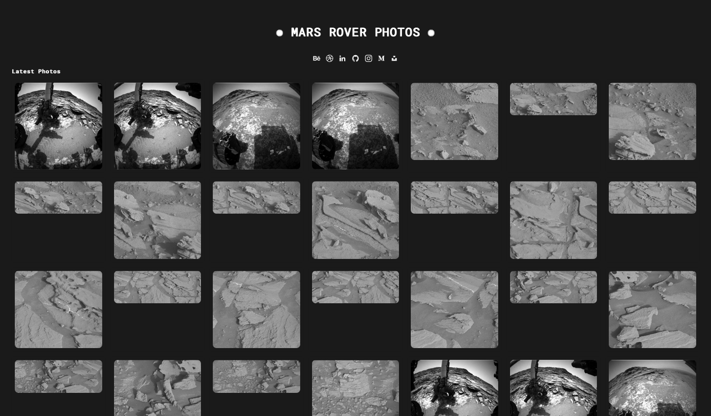

  

<h3>✺ Mars Rover Photos Website ✺</h3>

The Mars Rover Photos Website is an online platform that showcases captivating images captured by various Mars rovers. Developed using HTML, CSS, and JavaScript, this website provides a visual journey into the fascinating landscapes and scientific discoveries of the Martian surface.

<h4>✹ Overview ✹</h4>

Explore the beauty and mysteries of Mars through stunning photographs taken by the Mars rovers. This website brings you closer to the red planet by offering a curated collection of images that reveal its rugged terrain, unique geological features, and the rovers' tireless exploration.

<h4>✹ Features ✹</h4>

* <b>Image Gallery:</b> Immerse yourself in a diverse array of Mars Rover photos, capturing moments from the rovers' missions on the Martian surface.
* <b>Photo Details:</b> Gain insights into each image's context, including the camera used, the Martian sol (day) of capture, and the Earth date of the image.
* <b>Curiosity, Opportunity, Perseverance:</b> Browse images from multiple Mars rovers, each showcasing distinct perspectives of the planet.
* <b>Exploration:</b> Witness the ongoing exploration of Mars as captured by the rovers, highlighting the advancements in Martian science and technology.
* <b>Engagement:</b> Engage with the images and share your favorite Martian moments with friends and fellow enthusiasts.

<h4>✹ Design ✹</h4>

The Mars Rover Photos Website features a sleek and minimalist design, allowing the images to take center stage. The dark background enhances the visual impact of the Martian landscapes while providing a user-friendly browsing experience.

<h4>✹ Contribution to Space Exploration ✹</h4>

* <b>Appreciation:</b> By exploring the curated images, you're taking part in the awe-inspiring journey of space exploration and discovery.
* <b>Share:</b> Share your favorite images on social media to spread the wonder of Mars exploration and inspire others to learn about the universe.
* <b>Learn:</b> Delve into the details of each image to understand the scientific and geological significance of the Martian features captured.

<h4>✹ Link to the Project ✹</h4>

<h5>https://bypedroneres.github.io/Mars-rover-photos/</h5>

<h4>✹ Embark on a Martian Odyssey ✹</h4>

Thank you for joining us on this visual expedition to Mars. Through these images, we invite you to marvel at the wonders of another world and appreciate the collective human effort to uncover the mysteries of our celestial neighbor. As you navigate the website, remember that you're participating in the ongoing narrative of space exploration and discovery.
